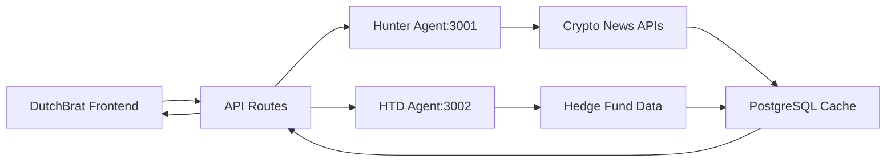

# AGENTS-dutchbrat-website-V7.md - AI Agent Documentation for DutchBrat Platform

## 🚀 Platform Overview for AI Agents

**Platform Name**: DutchBrat - Crypto Trading & Research Platform  
**Architecture**: Next.js + PostgreSQL + Multi-Agent Integration + External APIs  
**Purpose**: Comprehensive crypto trading platform with automated research, briefings, and social media integration  
**Domain**: **dutchbrat.com** (pure crypto/trading platform)  
**Status**: **V7 - Clean Separation & Pure Crypto Focus** 🎯

## 🎯 Platform Focus & Identity

**Core Business**: Crypto trading, research, and market intelligence  
**Target Audience**: Crypto traders, investors, and research-focused users  
**Value Proposition**: Automated market insights, curated briefings, and trading intelligence  
**Brand Identity**: Professional crypto trading platform with AI-powered insights

### **Complete Service Separation** *(V7 Update)*
- **Removed**: Dog walking service completely removed from platform
- **Focus**: 100% pure crypto/trading/research platform
- **Navigation**: Clean crypto-focused navigation without service confusion
- **Domain**: Pure dutchbrat.com identity for crypto business

## 🌐 Platform Architecture & Services

### **Core Navigation Structure**
```
🏠 dutchbrat.com/                 → Crypto homepage with market data
📊 dutchbrat.com/briefings        → Automated market briefings  
📰 dutchbrat.com/articles         → Research articles and analysis
🐾 dutchbrat.com/hunter           → Hunter's memorial gallery
🐦 dutchbrat.com/hunter-x         → Social media integration
📧 Newsletter & GitHub integration via external links
```

### **Service Portfolio**
- **Market Briefings**: Automated crypto market analysis and insights
- **Research Articles**: In-depth crypto and trading analysis  
- **Hunter Agent**: AI-powered crypto news aggregation
- **HTD Agent**: Hedge fund and institutional analysis
- **Price Data**: Real-time crypto price tracking and alerts
- **Social Integration**: Twitter/X integration for market sentiment
- **Hunter Gallery**: Memorial photo gallery (personal section)

## 🤖 Multi-Agent Integration Architecture

### **Primary Agents**
- **Hunter Agent** (hunter-agent:3001): Crypto news aggregation and analysis
- **HTD Agent** (htd-agent:3002): Hedge fund research and institutional insights
- **Social Media Bot**: Twitter/X integration and sentiment analysis

### **Agent Data Flow**


## 💻 Core API Architecture

### **Market Data Routes**
- **GET /api/briefings**: Multi-tier briefing cache orchestration
- **GET /api/latest-briefing**: Latest briefing metadata with caching
- **GET /api/crypto-news**: Hunter Agent proxy with fallback
- **GET /api/hedgefund-news**: HTD Agent proxy with error handling  
- **GET /api/mexc**: Exchange API proxy with rate limiting

### **Content Routes**
- **GET /api/latest-article**: Article aggregation with caching
- **GET /api/latest-tweet**: Social media integration
- **GET /api/htd-articles**: HTD research file system integration

### **Hunter Gallery Routes** *(Personal Section)*
- **GET /api/hunter/photos**: Photo gallery management
- **POST /api/hunter/auth**: Admin authentication for photo management
- **GET /api/hunter/auth/check**: Session validation

## 🗄️ Database Architecture

**Schema**: `agents_platform` (PostgreSQL)

### **Core Tables**
- **briefings**: Automated market briefing storage and caching
- **articles**: Research article metadata and content  
- **hunter_photos**: Memorial gallery image management
- **crypto_cache**: Price data and market information caching
- **social_data**: Twitter/X integration data storage

### **Caching Strategy**
- **Redis Integration**: High-performance caching for market data
- **Database Caching**: PostgreSQL-based caching for briefings and articles
- **File System Cache**: Static content caching for performance
- **Multi-Tier Fallbacks**: Graceful degradation for external service failures

## 🔗 External Service Integration

### **Market Data Providers**
- **Binance API**: Primary crypto price and market data
- **MEXC API**: Alternative exchange data and backup pricing
- **CoinGecko**: Market cap and trending data
- **Custom APIs**: Specialized crypto data sources

### **Research & News Sources**
- **Notion CMS**: Article and briefing content management
- **Hunter Agent**: Automated news aggregation
- **HTD Sources**: Hedge fund and institutional research feeds
- **RSS Feeds**: Multiple crypto news source integration

### **Communication Services**
- **Telegram Integration**: Admin notifications and alerts
- **Email Service**: Newsletter and notification delivery
- **Twitter/X API**: Social media integration and posting
- **Substack**: Newsletter platform integration

## 🎨 Frontend Architecture

### **Homepage Components**
- **CryptoPriceBlock**: Real-time crypto price banner
- **HeroIntro**: Personal introduction with 4-card service grid
- **LatestArticleCard**: Featured research content
- **TweetCard**: Latest social media integration  
- **HunterBlock**: Memorial section with photo gallery access

### **Responsive Design**
- **Mobile Optimization**: Touch-friendly interface for mobile traders
- **Desktop Focus**: Professional trading dashboard layout
- **Cross-Platform**: Consistent experience across devices
- **Performance**: Optimized loading for market data updates

## 📊 Performance & Scalability

### **Performance Metrics**
- **Page Load**: <2 seconds for main pages
- **API Response**: <500ms for cached data, <2s for live data
- **Uptime**: 99.9% availability target
- **Cache Hit Rate**: 85%+ for frequently accessed data

### **Scaling Strategy**
- **Microservice Architecture**: Agent-based service separation
- **Database Optimization**: Connection pooling and query optimization
- **CDN Integration**: Static asset optimization
- **Load Balancing**: Multi-instance support for high traffic

## 🔒 Security & Reliability

### **Security Measures**
- **API Rate Limiting**: Protection against abuse and overuse
- **Authentication**: Secure admin access for photo gallery management
- **Data Validation**: Input sanitization and SQL injection prevention
- **Environment Security**: Secure API key and credential management

### **Reliability Features**
- **Fallback Systems**: Multi-tier service fallbacks for external dependencies
- **Error Handling**: Graceful degradation when services are unavailable
- **Monitoring**: Comprehensive logging and error tracking
- **Backup Systems**: Database backup and recovery procedures

## 🛠️ Development Dependencies

### **Core Framework**
```bash
npm install next@latest
npm install react@latest  
npm install typescript
npm install tailwindcss
npm install @vercel/postgres
```

### **Crypto & Trading**
```bash
npm install ccxt              # Crypto exchange integration
npm install ws               # WebSocket for real-time data
npm install redis            # Caching layer
npm install node-cron        # Scheduled tasks
```

### **Content Management**
```bash
npm install @notionhq/client # Notion CMS integration
npm install rss-parser       # RSS feed processing
npm install cheerio          # Web scraping utilities
```

### **Communication**
```bash
npm install resend           # Email service
npm install node-telegram-bot-api # Telegram integration
npm install twitter-api-v2   # Twitter/X integration
```

## 📈 Business Intelligence & Analytics

### **Trading Metrics**
- **Market Coverage**: Track coverage of major crypto markets
- **Signal Accuracy**: Monitor trading signal performance
- **User Engagement**: Track briefing and article readership
- **Research Impact**: Measure influence of published research

### **Platform Analytics**
- **Content Performance**: Most popular briefings and articles
- **User Behavior**: Navigation patterns and engagement metrics
- **Technical Performance**: API response times and error rates
- **Growth Metrics**: User acquisition and retention analysis

## 🎯 Content Strategy & Publishing

### **Automated Content**
- **Daily Briefings**: Automated market analysis and insights
- **News Aggregation**: Curated crypto news from multiple sources
- **Price Alerts**: Significant market movement notifications
- **Research Summaries**: AI-generated research brief summaries

### **Manual Content**
- **Deep Research**: In-depth analysis articles
- **Market Commentary**: Personal trading insights and observations
- **Hunter Gallery**: Memorial photo content and personal stories
- **Newsletter**: Weekly/monthly trading insights compilation

## 🚀 Future Roadmap & Enhancements

### **Platform Enhancements**
- **Advanced Analytics**: Enhanced trading metrics and performance tracking
- **Mobile App**: Native mobile application for crypto tracking
- **Premium Features**: Subscription-based advanced analytics
- **Community Features**: Trader discussion and insight sharing

### **Technical Improvements**
- **Real-Time Data**: Enhanced WebSocket integration for live market data
- **AI Integration**: Advanced AI analysis for market prediction
- **API Expansion**: Additional exchange and data source integrations
- **Performance**: Further optimization for high-frequency data updates

## 📱 User Experience & Interface

### **Trader-Focused Design**
- **Market Dashboard**: Real-time data display with professional layout
- **Research Access**: Easy navigation to articles and briefings
- **Mobile Trading**: Touch-optimized interface for mobile users
- **Personal Section**: Hunter memorial gallery for personal connection

### **Content Discovery**
- **Smart Categorization**: Automated content classification
- **Search Functionality**: Advanced search across briefings and articles
- **Trending Content**: Popular and high-engagement content highlighting
- **Personalization**: User preference-based content recommendations

---

## 🎉 V7 Clean Separation Achievement

**Pure Crypto Platform Identity Established:**

✅ **Complete Service Separation**: Dog walking service completely removed from platform  
✅ **Pure Crypto Focus**: 100% dedicated to trading and research content  
✅ **Clean Navigation**: Professional crypto platform navigation structure  
✅ **Brand Clarity**: Clear dutchbrat.com identity for crypto trading business  
✅ **Technical Independence**: No cross-service dependencies or confusion  
✅ **Professional Image**: Clean, focused platform for crypto trading community  

**For AI Agents**: DutchBrat now operates as a pure crypto trading and research platform with complete separation from other services. Focus on crypto market data, trading insights, automated briefings, and research content when making recommendations. The platform maintains its sophisticated multi-agent architecture for crypto data aggregation while providing a clean, professional interface for traders and researchers. Leverage the Hunter Agent and HTD Agent for market insights, and utilize the comprehensive caching system for optimal performance.

**Latest V7 Updates**: Complete separation from non-crypto services, resulting in a focused, professional crypto trading platform. Enhanced navigation clarity, improved brand identity, and optimized user experience for the crypto trading community. The platform now maintains pure focus on its core mission of crypto trading insights and market intelligence.
