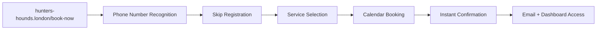

# AGENTS-hunters-hounds-V4.md - AI Agent Documentation for Hunter's Hounds Professional Website

## 🐶 Business Overview for AI Agents

**Service Name**: Hunter's Hounds Professional Dog Walking Service  
**Architecture**: Independent Next.js Website + PostgreSQL + External Service Integrations  
**Purpose**: Complete professional dog walking business website with booking, customer management, and marketing platform  
**Domain**: **hunters-hounds.london** & **hunters-hounds.com** (independent professional website)  
**Status**: **V4 - Complete Professional Website Architecture** 🎉

## 🌐 Complete Domain Architecture & Independence

### **Professional Domain Setup**
- **Primary Domain**: `hunters-hounds.london` → Direct to business IP (194.6.252.207)
- **Secondary Domain**: `hunters-hounds.com` → Direct to business IP  
- **Infrastructure**: Independent professional website, no longer embedded in DutchBrat
- **SEO Optimization**: Complete domain authority building for dog walking keywords
- **Brand Separation**: 100% independent Hunter's Hounds business identity

### **Domain Detection System**
```typescript
// lib/domainDetection.ts - Server-side domain detection
export function isHuntersHoundsDomain(): boolean {
  const host = headers().get('host') || '';
  return host.includes('hunters-hounds.');
}

// lib/clientDomainDetection.ts - Client-side domain detection  
export function useClientDomainDetection() {
  return typeof window !== 'undefined' && 
         window.location.host.includes('hunters-hounds.') 
         ? 'hunters-hounds' : 'other';
}
```

## 🎯 Professional Website Structure

### **Customer-Facing Pages (Professional URLs)**
```
🏠 hunters-hounds.london/                 → Homepage (emotional story + services overview)
💰 hunters-hounds.london/services         → Complete pricing & service details  
📅 hunters-hounds.london/book-now         → Professional booking experience
👤 hunters-hounds.london/my-account       → Customer dashboard & booking management
⭐ hunters-hounds.london/testimonials     → Customer testimonials (planned)
📸 hunters-hounds.london/gallery          → Dog walking photos/videos (planned)
📧 hunters-hounds.london/contact          → Contact information (optional)
```

### **Administrative & Functional Pages**
```
⚙️ hunters-hounds.london/dog-walking/admin    → Business admin dashboard
📊 hunters-hounds.london/dog-walking/admin/payments → Payment tracking
📝 hunters-hounds.london/dog-walking/admin/register-client → Client registration
📅 hunters-hounds.london/dog-walking/admin/create-booking → Manual booking creation
❌ hunters-hounds.london/dog-walking/cancel   → Email cancellation endpoint
```

### **API Routes (Backend Functionality)**
```
🔗 /api/dog-walking/book          → Booking creation
🔗 /api/dog-walking/availability  → Calendar availability
🔗 /api/dog-walking/user-lookup   → Customer lookup
🔗 /api/dog-walking/cancel        → Booking cancellation  
🔗 /api/dog-walking/dashboard     → Customer data
```

## 🎨 Enhanced Navigation Architecture

### **Professional Navbar Structure**
```typescript
// app/components/Navbar.tsx - Professional navigation
const huntersHoundsNav = [
  { href: "/", label: "Home" },
  { href: "/services", label: "Services & Pricing" },  
  { href: "/book-now", label: "Book Now" },
  { href: "/my-account", label: "My Account" },
  { href: "/testimonials", label: "Testimonials" }, // Planned
  { href: "/gallery", label: "Gallery" }, // Planned  
  { href: "/dog-walking/admin", label: "⚙️" } // Admin access
];
```

### **Dynamic Layout System**
```typescript
// app/layout.tsx - Professional metadata
if (isHuntersHoundsDomain()) {
  return {
    title: "Hunter's Hounds - Professional Dog Walking London",
    description: "Professional dog walking service in Highbury Fields & Clissold Park. Solo walks, dog sitting, meet & greet sessions. Reliable, caring service named after my beloved Dobermann Hunter.",
    keywords: "dog walking London, Highbury Fields, Clissold Park, professional pet care"
  };
}
```

## 🎯 Service Portfolio (Unchanged)

**Available Services:**
- **Meet & Greet** (30 min, FREE) - Introduction sessions for new clients
- **Solo Walk** (60 min, £17.50 / £25) - One-on-one attention and exercise  
- **Quick Walk** (30 min, £10) - Shorter park visits and play sessions
- **Dog Sitting** (Variable duration, From £25) - Customized in-home visits with extended flexibility

**Enhanced Business Constraints:**
- **Operating Hours**: 
  - **Dog Walking Services**: Monday-Friday, 9:00-20:00
  - **Dog Sitting**: Monday-Friday, 00:00-23:59 (24-hour availability)
- **Maximum Dogs**: 2 dogs per walk/sitting
- **Service Areas**: Highbury Fields & Clissold Park areas
- **Time Buffers**: 15-minute buffer between appointments
- **Multi-Day Support**: Dog sitting supports single-day and multi-day bookings

## 🗄️ Database Schema & Architecture (Unchanged)

**Schema**: `hunters_hounds` (within existing `agents_platform` database)

### Core Tables

**owners Table:**
```sql
CREATE TABLE hunters_hounds.owners (
    id SERIAL PRIMARY KEY,
    owner_name VARCHAR(255) NOT NULL,
    phone VARCHAR(20) UNIQUE NOT NULL,
    email VARCHAR(255) UNIQUE NOT NULL,
    address TEXT NOT NULL,
    created_at TIMESTAMP DEFAULT CURRENT_TIMESTAMP,
    updated_at TIMESTAMP DEFAULT CURRENT_TIMESTAMP
);
```

**dogs Table:**
```sql
CREATE TABLE hunters_hounds.dogs (
    id SERIAL PRIMARY KEY,
    owner_id INTEGER REFERENCES hunters_hounds.owners(id) ON DELETE CASCADE,
    dog_name VARCHAR(255) NOT NULL,
    dog_breed VARCHAR(255) NOT NULL,
    dog_age INTEGER NOT NULL,
    behavioral_notes TEXT,
    created_at TIMESTAMP DEFAULT CURRENT_TIMESTAMP,
    updated_at TIMESTAMP DEFAULT CURRENT_TIMESTAMP
);
```

**bookings Table:**
```sql
CREATE TABLE hunters_hounds.bookings (
    id SERIAL PRIMARY KEY,
    owner_id INTEGER REFERENCES hunters_hounds.owners(id) ON DELETE CASCADE,
    dog_id_1 INTEGER REFERENCES hunters_hounds.dogs(id) ON DELETE CASCADE,
    dog_id_2 INTEGER REFERENCES hunters_hounds.dogs(id) ON DELETE CASCADE NULL,
    service_type VARCHAR(50) NOT NULL CHECK (service_type IN ('meet-greet', 'solo-walk', 'quick-walk', 'dog-sitting')),
    
    -- Enhanced timing fields for multi-day support
    start_time TIMESTAMP NOT NULL,
    end_time TIMESTAMP NOT NULL,
    booking_type VARCHAR(20) DEFAULT 'single' CHECK (booking_type IN ('single', 'multi_day')),
    
    -- Additional fields
    price_pounds DECIMAL(6,2),
    google_event_id VARCHAR(255) UNIQUE,
    status VARCHAR(20) DEFAULT 'confirmed' CHECK (status IN ('confirmed', 'cancelled', 'completed')),
    cancellation_token VARCHAR(255) UNIQUE,
    created_at TIMESTAMP DEFAULT CURRENT_TIMESTAMP,
    updated_at TIMESTAMP DEFAULT CURRENT_TIMESTAMP,
    
    -- Multi-day booking constraints
    CONSTRAINT check_end_time_after_start CHECK (end_time >= start_time),
    CONSTRAINT bookings_start_time_confirmed_unique UNIQUE (start_time) WHERE status = 'confirmed'
);
```

## 🌐 Professional Customer Journey & User Experience

### **New Customer Flow**
```mermaid
graph LR
    A[Visit hunters-hounds.london] --> B[Beautiful Homepage]
    B --> C[Read Hunter's Story + Services]
    C --> D[Click 'Book a Walk' CTA]
    D --> E[/services - Detailed Pricing]
    E --> F[/book-now - Professional Booking]
    F --> G[Phone Lookup + Registration]
    G --> H[Service Selection + Calendar]
    H --> I[Booking Confirmation]
    I --> J[Email Confirmation + Dashboard Link]
    J --> K[/my-account - Customer Dashboard]
```

### **Returning Customer Flow**


## 💻 Enhanced API Routes & Endpoints (Updated URLs)

**Base Path**: `/api/dog-walking/` *(Backend paths unchanged for stability)*

### Core API Endpoints

**GET /api/dog-walking/availability**
- **Purpose**: Returns service-specific available time slots
- **Parameters**: 
  - `date` (required): YYYY-MM-DD format
  - `service_type` (optional): Service type filtering
  - `start_date` / `end_date` (optional): For multi-day queries
- **Logic**: Service-specific hours + buffer management
- **Response**: Array of available time slots

**GET /api/dog-walking/user-lookup?phone={phone}**
- **Purpose**: Customer account verification
- **Response**: `{exists: boolean, owner?: Object, dogs?: Array}`

**POST /api/dog-walking/book**
- **Purpose**: Create new booking with full automation
- **Integration**: Google Calendar + Email + Telegram + Database
- **Email Links**: Updated to new professional URLs
  - **Dashboard**: `${NEXT_PUBLIC_BASE_URL}/my-account`
  - **Cancellation**: `${NEXT_PUBLIC_BASE_URL}/dog-walking/cancel?token={token}`

**GET /api/dog-walking/dashboard** *(Authentication Required)*
- **Purpose**: Customer booking management
- **Response**: Upcoming + historical bookings with smart sorting

**POST /api/dog-walking/cancel**
- **Purpose**: Secure booking cancellation
- **Methods**: Email token OR dashboard booking ID
- **Integration**: Google Calendar + Database + Email notifications

## 🎨 Enhanced Frontend Architecture

### **Professional Homepage Components**
```typescript
// app/page.tsx - Domain-driven routing
export default function HomePage() {
  if (isHuntersHoundsDomain()) {
    redirect('/hunters-home'); // Beautiful professional homepage
  }
  return <DutchBratHomepage />; // Separated completely
}
```

### **Clean Booking Experience**
```typescript
// app/book-now/page.tsx - Professional booking page
export default function BookingPage() {
  return (
    <div className="professional-booking-experience">
      <Header title="Book Your Walk" />
      <QuickServiceOverview />
      <MobileBookingCalendar />
      <ContactSection />
    </div>
  );
}
```

### **Customer Dashboard**
```typescript
// app/my-account/page.tsx - Professional customer portal
import CustomerDashboard from "../components/CustomerDashboard";
export default function MyAccountPage() {
    return <CustomerDashboard />;
}
```

### **Dynamic Navigation System**
```typescript
// app/components/Navbar.tsx - Professional navigation
if (domainType === 'hunters-hounds') {
  return <HuntersHoundsNavigation />; // Professional business nav
}
return <DutchBratNavigation />; // Separate navigation
```

## 📧 Professional Email Templates & Communications

### **Updated Email Templates**
```typescript
// lib/emailTemplates.ts - Professional business emails
export function generateWelcomeEmail(data: WelcomeEmailData): string {
  return `
    <!-- Professional Hunter's Hounds branding -->
    <a href="https://hunters-hounds.london/book-now">Book a Service</a>
    <!-- Updated to professional URLs -->
  `;
}
```

### **Confirmation Email Updates**
```typescript
// app/api/dog-walking/book/route.ts - Updated email links
const dashboardLink = `${process.env.NEXT_PUBLIC_BASE_URL}/my-account`;
const cancellationLink = `${process.env.NEXT_PUBLIC_BASE_URL}/dog-walking/cancel?token=${cancellation_token}`;
```

### **Professional Email Content**
- **From Address**: `Hunter's Hounds <bookings@hunters-hounds.london>`
- **Dashboard Access**: All emails include professional dashboard links
- **Brand Consistency**: Complete Hunter's Hounds branding throughout
- **Mobile Optimization**: Professional mobile-friendly email templates

## 🎯 Marketing & Content Strategy

### **Planned Content Pages**

**Testimonials Page** (`/testimonials`)
- **Purpose**: Build trust through customer reviews
- **Content**: Customer testimonials, star ratings, dog owner quotes
- **Collection**: Post-booking email requests, manual collection
- **Display**: Beautiful cards with customer names, dog names, service type

**Gallery Page** (`/gallery`)
- **Purpose**: Visual proof of service quality
- **Content**: Photos/videos of dogs during walks, park locations
- **Privacy**: Customer permission required for all dog photos
- **Organization**: By location (Highbury Fields, Clissold Park), by service type

### **SEO Optimization Strategy**
- **Primary Keywords**: "dog walking London", "Highbury Fields dog walker", "Clissold Park pet care"
- **Long-tail**: "professional dog walking Islington", "trusted pet care North London"
- **Local SEO**: Google My Business integration, local directory listings
- **Content Marketing**: Blog potential for dog care tips, local park guides

## 🔒 Security & Data Protection (Enhanced)

### **Professional Security Measures**
- **Domain Security**: Direct DNS management, no redirect vulnerabilities
- **Customer Data**: GDPR-compliant data handling with audit trails
- **Payment Security**: Manual payment tracking with admin dashboard
- **API Security**: Rate limiting, input validation, SQL injection prevention
- **Email Security**: Professional business email with SPF/DKIM records

### **Business Compliance**
- **Data Protection**: Customer consent tracking for photos/testimonials
- **Privacy Policy**: Professional privacy policy for business website
- **Terms of Service**: Clear booking terms and cancellation policies
- **Insurance**: Business liability coverage (as required)

## 📊 Analytics & Business Intelligence

### **Performance Metrics** *(Professional Website)*
- **Website Traffic**: Google Analytics on hunters-hounds.london
- **Conversion Rates**: Visitor → Booking conversion tracking
- **Customer Retention**: Repeat booking analysis
- **Service Demand**: Popular time slots and service preferences
- **Geographic Data**: Customer location analysis for service expansion

### **Business KPIs**
- **Weekly Bookings**: Target 50+ bookings/week across all services
- **Customer Base**: 100+ active customers with repeat bookings
- **Revenue Tracking**: Service revenue analysis and pricing optimization
- **Customer Satisfaction**: Review scores and testimonial collection

## 🛠️ Development Architecture & Dependencies

### **Core Dependencies**
```bash
# Database & APIs (unchanged)
npm install @vercel/postgres
npm install @google-cloud/calendar  
npm install resend
npm install date-fns
npm install react-day-picker

# Professional Website Enhancement
npm install next/image        # Image optimization
npm install tailwindcss       # Professional styling
npm install typescript        # Type safety
```

### **Environment Configuration**
```bash
# Domain Configuration
NEXT_PUBLIC_BASE_URL=https://hunters-hounds.london

# Database (unchanged)
POSTGRES_HOST=postgres
POSTGRES_DB=agents_platform
POSTGRES_USER=hunter_admin
POSTGRES_PASSWORD=secure_password

# External Services (unchanged)
GOOGLE_CALENDAR_ID=calendar_id
RESEND_API_KEY=api_key
TELEGRAM_BOT_TOKEN=bot_token
```

## 🚀 Scalability & Growth Strategy

### **Technical Scalability**
- **Independent Infrastructure**: Complete separation allows independent scaling
- **Database Optimization**: Indexed queries for high-volume booking operations
- **CDN Integration**: Image optimization for gallery and testimonial photos
- **Mobile Optimization**: Progressive Web App capabilities for mobile bookings

### **Business Scalability**
- **Geographic Expansion**: Additional service areas with location-based routing
- **Staff Expansion**: Multi-walker support with individual calendar management
- **Service Diversification**: Pet grooming, training, boarding integration
- **Franchise Model**: White-label platform for other dog walking businesses

## 📱 Customer Experience Enhancements

### **Mobile-First Design**
- **Touch-Friendly Booking**: Optimized calendar selection on mobile devices
- **WhatsApp Integration**: Direct messaging for customer support
- **SMS Notifications**: Booking reminders and updates via SMS
- **Progressive Web App**: App-like experience for repeat customers

### **Customer Self-Service**
- **Dashboard Features**: Complete booking history, upcoming appointments
- **Profile Management**: Update contact details, dog information
- **Booking Modifications**: Reschedule or cancel bookings independently  
- **Payment History**: Track service payments and invoices

## 📋 Operational Procedures (Updated)

### **Daily Business Operations**
- **Admin Dashboard**: `/dog-walking/admin` for daily booking management
- **Payment Tracking**: Manual payment recording with YTD statistics
- **Customer Communication**: Automated emails + personal WhatsApp contact
- **Calendar Management**: Google Calendar integration for availability

### **Customer Onboarding**
1. **Website Discovery**: Professional website drives organic traffic
2. **Service Information**: Clear pricing and service descriptions  
3. **Easy Booking**: Streamlined registration and booking process
4. **Welcome Email**: Professional welcome with service overview
5. **Dashboard Access**: Customer portal for ongoing management

### **Quality Assurance**
- **Service Delivery**: Consistent high-quality service execution
- **Customer Feedback**: Regular collection of testimonials and reviews
- **Photo Documentation**: Service proof with customer permission
- **Continuous Improvement**: Service refinement based on customer feedback

## 🎯 Success Metrics & Monitoring

### **Website Performance**
- **Page Load Speed**: <2 seconds for all customer-facing pages
- **Mobile Optimization**: 95+ Google PageSpeed score on mobile
- **Conversion Rate**: 15%+ visitor-to-booking conversion
- **SEO Rankings**: Top 3 for "dog walking Highbury Fields"

### **Business Performance**
- **Customer Acquisition**: 20+ new customers per month via website
- **Customer Retention**: 80%+ repeat booking rate
- **Service Utilization**: Balanced demand across all service types
- **Revenue Growth**: 20% month-over-month growth target

---

## 🎉 V4 Achievements Summary

**Complete Professional Website Architecture Established:**

✅ **Independent Business Website**: Fully separated from DutchBrat with professional domain  
✅ **Clean URL Structure**: Customer-friendly URLs reflecting business professionalism  
✅ **Professional Navigation**: Business-focused menu structure and page organization  
✅ **Enhanced Customer Journey**: Optimized flow from discovery to booking to management  
✅ **Complete Brand Identity**: 100% Hunter's Hounds branding throughout  
✅ **SEO Foundation**: Professional domain authority building for organic growth  
✅ **Scalable Architecture**: Framework for testimonials, gallery, and future enhancements  

**For AI Agents**: Hunter's Hounds now operates as a complete professional website with independent domain architecture. Focus on the clean URL structure (/book-now, /my-account, /services) for customer-facing recommendations, while maintaining backend API functionality at existing paths for stability. The domain detection system enables different content serving based on the requesting domain, creating a fully professional customer experience. Leverage the professional navigation structure and enhanced customer journey for optimal user experience recommendations. All customer communications now use professional hunters-hounds.london URLs, establishing proper business identity and SEO authority.

**Latest V4 Updates**: Complete domain separation and professional website architecture implemented. Independent business website with professional URLs, enhanced navigation, updated email templates, and framework for testimonials/gallery pages. The platform now operates as a complete professional business website rather than an embedded service, enabling optimal SEO performance and customer experience.
