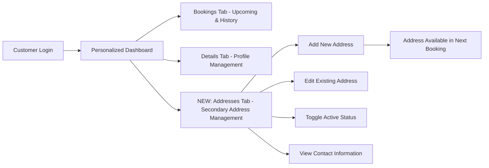

# AGENTS-hunters-hounds-V6.md - AI Agent Documentation for Hunter's Hounds Professional Website

## 🐶 Business Overview for AI Agents

**Service Name**: Hunter's Hounds Professional Dog Walking Service  
**Architecture**: Independent Next.js Website + PostgreSQL + External Service Integrations  
**Purpose**: Complete professional dog walking business website with booking, customer management, and marketing platform  
**Domain**: **hunters-hounds.london** & **hunters-hounds.com** (independent professional website)  
**Status**: **V6 - Secondary Addresses & Multi-Location Service** 🎉

## 🌐 Complete Domain Architecture & Independence

### **Professional Domain Setup**
- **Primary Domain**: `hunters-hounds.london` → Direct to business IP (194.6.252.207)
- **Secondary Domain**: `hunters-hounds.com` → Direct to business IP  
- **Infrastructure**: Independent professional website, no longer embedded in DutchBrat
- **SEO Optimization**: Complete domain authority building for dog walking keywords
- **Brand Separation**: 100% independent Hunter's Hounds business identity

### **Domain Detection System**
```typescript
// lib/domainDetection.ts - Server-side domain detection
export function isHuntersHoundsDomain(): boolean {
  const host = headers().get('host') || '';
  return host.includes('hunters-hounds.');
}

// lib/clientDomainDetection.ts - Client-side domain detection  
export function useClientDomainDetection() {
  return typeof window !== 'undefined' && 
         window.location.host.includes('hunters-hounds.') 
         ? 'hunters-hounds' : 'other';
}
```

## 🎯 Professional Website Structure

### **Customer-Facing Pages (Professional URLs)**
```
🏠 hunters-hounds.london/                 → Homepage (emotional story + services overview)
💰 hunters-hounds.london/services         → Complete pricing & service details  
📅 hunters-hounds.london/book-now         → ENHANCED: Professional booking with address selection
👤 hunters-hounds.london/my-account       → ENHANCED: Personalized dashboard with secondary address management
⭐ hunters-hounds.london/testimonials     → Customer testimonials (planned)
📸 hunters-hounds.london/gallery          → Dog walking photos/videos (planned)
📧 hunters-hounds.london/contact          → Contact information (optional)
```

### **Administrative & Functional Pages**
```
⚙️ hunters-hounds.london/dog-walking/admin              → Business admin dashboard
📋 hunters-hounds.london/dog-walking/admin/manage-clients → Complete client management system
📊 hunters-hounds.london/dog-walking/admin/payments     → Payment tracking
📝 hunters-hounds.london/dog-walking/admin/register-client → Client registration
📅 hunters-hounds.london/dog-walking/admin/create-booking → Manual booking creation
❌ hunters-hounds.london/dog-walking/cancel             → Email cancellation endpoint
```

### **API Routes (Backend Functionality)**
```
🔗 /api/dog-walking/book                → ENHANCED: Booking with secondary address support
🔗 /api/dog-walking/availability        → Calendar availability
🔗 /api/dog-walking/user-lookup         → Customer lookup (phone + email + image_filename)
🔗 /api/dog-walking/customer-lookup     → Customer lookup (phone + email + image_filename)
🔗 /api/dog-walking/cancel              → Booking cancellation  
🔗 /api/dog-walking/dashboard           → Customer data

# Client Management API Routes
🔗 /api/dog-walking/admin/clients               → Paginated client list with search
🔗 /api/dog-walking/admin/clients/[clientId]    → Individual client CRUD operations
🔗 /api/dog-walking/admin/photo-check           → Generate photo filenames
🔗 /api/dog-walking/admin/photo-check/[filename] → Check photo file existence

# NEW V6: Secondary Addresses API Routes
🔗 /api/dog-walking/secondary-addresses         → GET/POST secondary addresses
🔗 /api/dog-walking/secondary-addresses/[id]    → PUT/DELETE specific address
🔗 /api/dog-walking/secondary-addresses/[id]/toggle → PATCH toggle active status
```

## 🎨 Enhanced Navigation Architecture

### **Professional Navbar Structure**
```typescript
// app/components/Navbar.tsx - Professional navigation
const huntersHoundsNav = [
  { href: "/", label: "Home" },
  { href: "/services", label: "Services & Pricing" },  
  { href: "/book-now", label: "Book Now" },
  { href: "/my-account", label: "My Account" },
  { href: "/testimonials", label: "Testimonials" }, // Planned
  { href: "/gallery", label: "Gallery" }, // Planned  
  { href: "/dog-walking/admin", label: "⚙️" } // Admin access
];
```

### **Dynamic Layout System**
```typescript
// app/layout.tsx - Professional metadata
if (isHuntersHoundsDomain()) {
  return {
    title: "Hunter's Hounds - Professional Dog Walking London",
    description: "Professional dog walking service in Highbury Fields & Clissold Park. Solo walks, dog sitting, meet & greet sessions. Reliable, caring service named after my beloved Dobermann Hunter.",
    keywords: "dog walking London, Highbury Fields, Clissold Park, professional pet care"
  };
}
```

## 🎯 Service Portfolio (Unchanged)

**Available Services:**
- **Meet & Greet** (30 min, FREE) - Introduction sessions for new clients
- **Solo Walk** (60 min, £17.50 / £25) - One-on-one attention and exercise  
- **Quick Walk** (30 min, £10) - Shorter park visits and play sessions
- **Dog Sitting** (Variable duration, From £25) - Customized in-home visits with extended flexibility

**Enhanced Business Constraints:**
- **Operating Hours**: 
  - **Dog Walking Services**: Monday-Friday, 9:00-20:00
  - **Dog Sitting**: Monday-Friday, 00:00-23:59 (24-hour availability)
- **Maximum Dogs**: 2 dogs per walk/sitting
- **Service Areas**: Highbury Fields & Clissold Park areas (EXPANDED with secondary addresses)
- **Time Buffers**: 15-minute buffer between appointments
- **Multi-Day Support**: Dog sitting supports single-day and multi-day bookings

## 🗄️ Enhanced Database Schema & Architecture

**Schema**: `hunters_hounds` (within existing `agents_platform` database)

### Core Tables

**owners Table:**
```sql
CREATE TABLE hunters_hounds.owners (
    id SERIAL PRIMARY KEY,
    owner_name VARCHAR(255) NOT NULL,
    phone VARCHAR(20) UNIQUE NOT NULL,
    email VARCHAR(255) UNIQUE NOT NULL,
    partner_name VARCHAR(255), -- NEW V6: Partner contact support
    partner_email VARCHAR(255), -- NEW V6: Partner email for notifications
    partner_phone VARCHAR(255), -- NEW V6: Partner phone for backup contact
    address TEXT NOT NULL,
    created_at TIMESTAMP DEFAULT CURRENT_TIMESTAMP,
    updated_at TIMESTAMP DEFAULT CURRENT_TIMESTAMP
);
```

**dogs Table:**
```sql
CREATE TABLE hunters_hounds.dogs (
    id SERIAL PRIMARY KEY,
    owner_id INTEGER REFERENCES hunters_hounds.owners(id) ON DELETE CASCADE,
    dog_name VARCHAR(255) NOT NULL,
    dog_breed VARCHAR(255) NOT NULL,
    dog_age INTEGER NOT NULL,
    behavioral_notes TEXT,
    image_filename VARCHAR(255) DEFAULT NULL,
    created_at TIMESTAMP DEFAULT CURRENT_TIMESTAMP,
    updated_at TIMESTAMP DEFAULT CURRENT_TIMESTAMP
);

CREATE INDEX idx_dogs_image_filename ON hunters_hounds.dogs(image_filename);
CREATE INDEX idx_dogs_id_desc ON hunters_hounds.dogs(id DESC);
CREATE INDEX idx_owners_id_desc ON hunters_hounds.owners(id DESC);
```

**NEW V6: secondary_addresses Table:**
```sql
CREATE TABLE hunters_hounds.secondary_addresses (
    id SERIAL PRIMARY KEY,
    owner_id INTEGER REFERENCES hunters_hounds.owners(id) ON DELETE CASCADE,
    address_label VARCHAR(255) NOT NULL, -- e.g., "Sarah's House", "Grandma's Place"
    address TEXT NOT NULL,
    contact_name VARCHAR(255) NOT NULL, -- Primary contact at this address
    contact_email VARCHAR(255) NOT NULL,
    contact_phone VARCHAR(255),
    partner_name VARCHAR(255), -- Secondary contact (e.g., spouse)
    partner_email VARCHAR(255),
    partner_phone VARCHAR(255),
    is_active BOOLEAN DEFAULT true,
    notes TEXT, -- Special instructions for this address
    created_at TIMESTAMP DEFAULT CURRENT_TIMESTAMP,
    updated_at TIMESTAMP DEFAULT CURRENT_TIMESTAMP,
    CONSTRAINT unique_label_per_owner UNIQUE (owner_id, address_label)
);

CREATE INDEX idx_secondary_addresses_owner_id ON hunters_hounds.secondary_addresses(owner_id);
CREATE INDEX idx_secondary_addresses_active ON hunters_hounds.secondary_addresses(is_active);
```

**bookings Table (ENHANCED V6):**
```sql
CREATE TABLE hunters_hounds.bookings (
    id SERIAL PRIMARY KEY,
    owner_id INTEGER REFERENCES hunters_hounds.owners(id) ON DELETE CASCADE,
    dog_id_1 INTEGER REFERENCES hunters_hounds.dogs(id) ON DELETE CASCADE,
    dog_id_2 INTEGER REFERENCES hunters_hounds.dogs(id) ON DELETE CASCADE NULL,
    service_type VARCHAR(50) NOT NULL CHECK (service_type IN ('meet-greet', 'solo-walk', 'quick-walk', 'dog-sitting')),
    
    -- Enhanced timing fields
    start_time TIMESTAMP NOT NULL,
    end_time TIMESTAMP NOT NULL,
    booking_type VARCHAR(20) DEFAULT 'single' CHECK (booking_type IN ('single', 'multi_day')),
    
    -- NEW V6: Secondary address support
    secondary_address_id INTEGER REFERENCES hunters_hounds.secondary_addresses(id) ON DELETE SET NULL,
    
    -- Additional fields
    price_pounds DECIMAL(6,2),
    google_event_id VARCHAR(255) UNIQUE,
    status VARCHAR(20) DEFAULT 'confirmed' CHECK (status IN ('confirmed', 'cancelled', 'completed')),
    cancellation_token VARCHAR(255) UNIQUE,
    created_at TIMESTAMP DEFAULT CURRENT_TIMESTAMP,
    updated_at TIMESTAMP DEFAULT CURRENT_TIMESTAMP,
    
    -- Constraints
    CONSTRAINT check_end_time_after_start CHECK (end_time >= start_time),
    CONSTRAINT bookings_start_time_confirmed_unique UNIQUE (start_time) WHERE status = 'confirmed'
);

CREATE INDEX idx_bookings_secondary_address_id ON hunters_hounds.bookings(secondary_address_id);
```

### NEW V6: Email Distribution System

**Database Functions for Multi-Recipient Emails:**
```sql
-- Function to get all email recipients for a booking
CREATE OR REPLACE FUNCTION hunters_hounds.get_booking_emails(booking_id_param integer)
RETURNS text[]
LANGUAGE plpgsql
AS $$
DECLARE
    result_emails text[];
BEGIN
    SELECT ARRAY(
        SELECT DISTINCT email FROM (
            -- Primary customer email
            SELECT o.email FROM hunters_hounds.bookings b
            JOIN hunters_hounds.owners o ON b.owner_id = o.id
            WHERE b.id = booking_id_param AND o.email IS NOT NULL
            
            UNION
            
            -- Primary customer partner email
            SELECT o.partner_email FROM hunters_hounds.bookings b
            JOIN hunters_hounds.owners o ON b.owner_id = o.id
            WHERE b.id = booking_id_param AND o.partner_email IS NOT NULL
            
            UNION
            
            -- Secondary address contact email
            SELECT sa.contact_email FROM hunters_hounds.bookings b
            JOIN hunters_hounds.secondary_addresses sa ON b.secondary_address_id = sa.id
            WHERE b.id = booking_id_param AND sa.contact_email IS NOT NULL AND sa.is_active = true
            
            UNION
            
            -- Secondary address partner email
            SELECT sa.partner_email FROM hunters_hounds.bookings b
            JOIN hunters_hounds.secondary_addresses sa ON b.secondary_address_id = sa.id
            WHERE b.id = booking_id_param AND sa.partner_email IS NOT NULL AND sa.is_active = true
        ) all_emails
    ) INTO result_emails;
    RETURN result_emails;
END;
$$;

-- View for debugging email distribution
CREATE VIEW hunters_hounds.booking_all_emails AS
SELECT 
    b.id as booking_id,
    b.owner_id,
    b.secondary_address_id,
    o.email as primary_email,
    o.partner_email as primary_partner_email,
    sa.contact_email as secondary_contact_email,
    sa.partner_email as secondary_partner_email,
    hunters_hounds.get_booking_emails(b.id) as all_emails
FROM hunters_hounds.bookings b
JOIN hunters_hounds.owners o ON b.owner_id = o.id
LEFT JOIN hunters_hounds.secondary_addresses sa ON b.secondary_address_id = sa.id;
```

## 🎯 NEW V6: Secondary Addresses Feature

### **Complete Address Management System**
```typescript
// Enhanced customer dashboard with secondary address management

✅ **Address Dashboard Tab**: Third tab in customer dashboard for address management
✅ **CRUD Operations**: Create, read, update, delete secondary addresses
✅ **Contact Management**: Primary contact + partner contact per address
✅ **Status Control**: Active/inactive toggle for temporary addresses
✅ **Validation**: Unique address labels per customer, required field validation
✅ **Notes Support**: Special instructions field for each address
```

### **Enhanced Booking Flow with Address Selection**
```typescript
// New booking step: Address Selection (between dog selection and final confirmation)

✅ **Address Selection Step**: Choose primary address or any active secondary address
✅ **Visual Address Display**: Shows full address, contact info, and notes for each option
✅ **Smart Defaults**: Primary address pre-selected, secondary addresses as alternatives
✅ **Contact Visibility**: Displays who will be notified for each address option
✅ **Navigation Flow**: Dog Selection → Address Selection → Final Booking
✅ **Mobile Optimization**: Address cards stack vertically on mobile devices
```

### **Multi-Recipient Email System**
```typescript
// Intelligent email distribution based on selected address

✅ **Primary Address Booking**: 
   - Customer email + Partner email (if set)
   
✅ **Secondary Address Booking**:
   - Customer email + Customer partner email
   - Secondary address contact email + Secondary address partner email
   
✅ **Email Intelligence**: 
   - Automatic deduplication of email addresses
   - Only sends to active addresses
   - Skips null/empty email fields
   - Business email always BCC'd
   
✅ **Calendar Integration**: 
   - Google Calendar events show correct address
   - Location field displays address label and full address
   - All contacts receive calendar invitations
   
✅ **Telegram Notifications**: 
   - Business notifications include address information
   - Shows which address was selected for pickup/dropoff
```

### **Secondary Addresses API Architecture**
```typescript
// Complete REST API for secondary address management

interface SecondaryAddress {
    id: number;
    owner_id: number;
    address_label: string;        // "Sarah's House", "Office"
    address: string;              // Full address
    contact_name: string;         // Primary contact
    contact_email: string;        // Primary email
    contact_phone?: string;       // Primary phone
    partner_name?: string;        // Secondary contact
    partner_email?: string;       // Secondary email  
    partner_phone?: string;       // Secondary phone
    is_active: boolean;           // Active status
    notes?: string;               // Special instructions
    created_at: string;
    updated_at: string;
}

// API Endpoints:
// GET    /api/dog-walking/secondary-addresses?owner_id={id} → List addresses
// POST   /api/dog-walking/secondary-addresses              → Create address
// PUT    /api/dog-walking/secondary-addresses/[id]         → Update address
// DELETE /api/dog-walking/secondary-addresses/[id]         → Delete address
// PATCH  /api/dog-walking/secondary-addresses/[id]/toggle  → Toggle active status
```

### **Address Management Features**
```typescript
// Comprehensive address management with safety features

✅ **Validation Rules**:
   - Unique address labels per customer
   - Required fields: label, address, contact_name, contact_email
   - Email format validation
   - Address length limits
   
✅ **Safety Features**:
   - Cannot delete addresses used in future bookings
   - Cannot deactivate addresses with confirmed upcoming bookings
   - Transaction-based operations with rollback support
   - Audit trail with created_at/updated_at timestamps
   
✅ **User Experience**:
   - Clean card-based UI matching dashboard theme
   - Inline editing with modal interface
   - Real-time validation feedback
   - Active/inactive visual status indicators
   - Notes field for special pickup/dropoff instructions
```

## 🌐 Professional Customer Journey & User Experience (ENHANCED V6)

### **NEW: Enhanced Customer Booking Flow**
```mermaid
graph LR
    A[Visit hunters-hounds.london] --> B[Beautiful Homepage]
    B --> C[Read Hunter's Story + Services]
    C --> D[Click 'Book a Walk' CTA]
    D --> E[/services - Detailed Pricing]
    E --> F[/book-now - Professional Booking]
    F --> G[Phone/Email Lookup + Registration]
    G --> H[Service Selection + Calendar]
    H --> I[Dog Selection]
    I --> J[NEW: Address Selection - Primary or Secondary]
    J --> K[Final Booking Confirmation with Address Info]
    K --> L[Multi-Recipient Email Confirmation]
    L --> M[Personalized Dashboard with Address Management]
```

### **Enhanced Dashboard Experience (V6)**


## 💻 Enhanced API Routes & Endpoints (V6)

**Base Path**: `/api/dog-walking/` *(Backend paths unchanged for stability)*

### Core API Endpoints (ENHANCED V6)

**POST /api/dog-walking/book** *(ENHANCED)*
- **Purpose**: Create booking with secondary address support
- **NEW Features**:
  - ✅ Accepts `secondary_address_id` parameter (null = primary address)
  - ✅ Validates secondary address belongs to customer and is active
  - ✅ Calendar events show correct address label and location
  - ✅ Emails sent to all relevant contacts automatically
  - ✅ Telegram notifications include address information
- **Integration**: Google Calendar + Multi-Recipient Email + Telegram + Database
- **Response**: Includes `address_label` field in booking confirmation

**GET /api/dog-walking/dashboard** *(ENHANCED)*
- **Purpose**: Customer booking management with address info
- **NEW Features**:
  - ✅ Booking history shows address labels
  - ✅ Distinguishes primary vs secondary address bookings
- **Response**: Bookings include address information for context

### NEW V6: Secondary Addresses API Endpoints

**GET /api/dog-walking/secondary-addresses**
- **Purpose**: List secondary addresses for customer
- **Parameters**: `owner_id` (required) - Customer ID
- **Features**:
  - ✅ Returns only addresses belonging to specified owner
  - ✅ Includes all contact information (primary + partner)
  - ✅ Shows active/inactive status
  - ✅ Ordered by creation date (newest first)
- **Response**: Array of `SecondaryAddress` objects

**POST /api/dog-walking/secondary-addresses**  
- **Purpose**: Create new secondary address
- **Validation**:
  - ✅ Unique address label per customer
  - ✅ Owner exists in database
  - ✅ Required fields: address_label, address, contact_name, contact_email
  - ✅ Email format validation
- **Features**:
  - ✅ Transaction-based creation with error rollback
  - ✅ Automatic timestamp creation
- **Response**: Created address with generated ID

**PUT /api/dog-walking/secondary-addresses/[id]**
- **Purpose**: Update existing secondary address
- **Validation**:
  - ✅ Address belongs to authenticated customer
  - ✅ Label uniqueness (excluding current address)
  - ✅ Required field validation
- **Features**:
  - ✅ Partial updates supported (only changed fields)
  - ✅ Automatic updated_at timestamp
- **Response**: Updated address object

**DELETE /api/dog-walking/secondary-addresses/[id]**
- **Purpose**: Delete secondary address
- **Safety Features**:
  - ✅ Cannot delete if used in any bookings (past or future)
  - ✅ Prevents orphaned booking references
  - ✅ Transaction-based deletion
- **Validation**: Address belongs to authenticated customer
- **Response**: Success confirmation or error with reason

**PATCH /api/dog-walking/secondary-addresses/[id]/toggle**
- **Purpose**: Toggle active/inactive status
- **Safety Features**:
  - ✅ Cannot deactivate if future confirmed bookings exist
  - ✅ Can always reactivate inactive addresses
  - ✅ Protects booking integrity
- **Features**:
  - ✅ Automatic status flip (active ↔ inactive)
  - ✅ Returns new status in response
- **Use Cases**: Temporary addresses, seasonal locations, moving situations

## 🎨 Enhanced Frontend Architecture (V6)

### **Enhanced Customer Dashboard**
```typescript
// app/my-account/page.tsx - Now with address management
interface DashboardView {
    bookings: BookingHistory;
    details: CustomerProfile;
    addresses: SecondaryAddressManagement; // NEW V6
}

// Customer dashboard now includes:
// ✅ Third tab: "📍 Secondary Addresses"  
// ✅ Complete CRUD interface for address management
// ✅ Visual status indicators (active/inactive)
// ✅ Contact information display (primary + partner)
// ✅ Notes field for special instructions
// ✅ Integration with booking flow
```

### **Enhanced Booking Experience**
```typescript
// app/book-now/page.tsx - Address selection integration
interface BookingFlow {
    serviceSelection: ServiceType;
    dateTimeSelection: Calendar;
    customerLookup: Authentication;
    dogSelection: DogChoice[];
    addressSelection: AddressChoice; // NEW V6: Primary or Secondary
    finalConfirmation: BookingSummary;
}

// New address selection step:
// ✅ Displays primary address (from customer record)
// ✅ Lists all active secondary addresses
// ✅ Shows contact information for each address
// ✅ Displays special notes/instructions
// ✅ Mobile-responsive card layout
// ✅ Clear visual selection states
```

### **Address Management Component**
```typescript
// components/SecondaryAddresses.tsx - Complete CRUD interface
interface SecondaryAddressesProps {
    owner_id: number;
}

// Features:
// ✅ Card-based layout matching dashboard design
// ✅ Add/Edit modal with form validation
// ✅ Delete confirmation with safety checks
// ✅ Active/inactive toggle with visual feedback
// ✅ Contact information display (primary + partner)
// ✅ Notes field for special instructions
// ✅ Real-time validation and error handling
// ✅ Loading states during API operations
// ✅ Success/error notifications
```

## 📧 Enhanced Email Templates & Communications (V6)

### **Multi-Recipient Email System**
```typescript
// lib/emailService.ts - Intelligent email distribution
interface BookingEmailData {
    booking_id: number;
    recipients: string[]; // Automatically determined based on address
    address_info: {
        type: 'primary' | 'secondary';
        label: string;
        address: string;
        contacts: string[];
    };
}

// Email recipient logic:
// PRIMARY ADDRESS:   Customer + Partner
// SECONDARY ADDRESS: Customer + Partner + Secondary Contact + Secondary Partner
```

### **Enhanced Email Content (V6)**
```typescript
// Email templates now include address information:

✅ **Location Display**: 
   - "Location: Primary Address" 
   - "Location: Sarah's House"
   - Full address displayed in email body

✅ **Contact Context**:
   - Shows who will be present at pickup/dropoff
   - Displays contact information for coordination
   - Notes field appears in email for special instructions

✅ **Calendar Integration**:
   - Google Calendar events include correct address
   - Location field shows both label and full address
   - All relevant contacts receive calendar invitations
```

### **Professional Email Templates**
- **From Address**: `Hunter's Hounds <bookings@hunters-hounds.london>`
- **Dashboard Access**: All emails include personalized dashboard links
- **Address Information**: Clear location details for every booking
- **Contact Coordination**: All relevant parties automatically notified
- **Mobile Optimization**: Professional mobile-friendly templates

## 🎯 Enhanced Marketing & Content Strategy (V6)

### **Expanded Service Areas**
- **Primary Coverage**: Highbury Fields & Clissold Park
- **Secondary Addresses**: Customer-defined locations within reasonable distance
- **Flexible Service**: Pickup from one address, dropoff at another
- **Multi-Location Customers**: Seamless service across customer's locations

### **SEO Enhancements**
- **Geo-Targeting**: Expanded location coverage through secondary addresses
- **Local Keywords**: "dog walking multiple locations London"  
- **Service Flexibility**: "pickup dropoff different addresses"
- **Customer Convenience**: "dog care at your convenience"

## 🔒 Security & Data Protection (Enhanced V6)

### **Secondary Address Security**
- **Data Isolation**: Addresses only accessible by owning customer
- **Contact Privacy**: Partner information protected and optional
- **Access Control**: API endpoints validate customer ownership
- **Audit Trail**: Created/updated timestamps for all address changes
- **Data Integrity**: Foreign key constraints prevent orphaned records

### **Email Security (V6)**
- **Contact Verification**: Email addresses validated before storage
- **Deduplication**: Automatic removal of duplicate recipients
- **Privacy Protection**: Only relevant contacts notified per booking
- **Opt-out Respect**: Partner contacts can be left blank for privacy

## 📊 Analytics & Business Intelligence (V6)

### **Enhanced Performance Metrics**
- **Address Utilization**: Track usage of secondary addresses vs primary
- **Multi-Location Customers**: Identify customers with multiple service locations  
- **Contact Engagement**: Monitor which contacts interact with emails/calendar
- **Service Flexibility**: Measure customer satisfaction with location options
- **Geographic Analysis**: Understand service area expansion through addresses

### **Business KPIs (V6)**
- **Location Diversity**: Number of secondary addresses per customer
- **Contact Network**: Size of notification network per customer
- **Service Convenience**: Customer feedback on address flexibility
- **Operational Efficiency**: Time saved through automated multi-recipient notifications

## 🚀 Scalability & Growth Strategy (V6)

### **Enhanced Technical Scalability**
- **Multi-Location Architecture**: Database designed for unlimited addresses per customer
- **Contact Network Growth**: Email system scales automatically with contact additions
- **Geographic Expansion**: Secondary addresses enable broader service coverage
- **Family/Business Support**: Partners and secondary contacts extend customer reach

### **Business Scalability (V6)**
- **Service Area Growth**: Organic expansion through customer secondary addresses
- **Multi-Generational Customers**: Grandparents, family homes, office locations
- **Business Customers**: Multiple office locations, employee pet services  
- **Relationship Networks**: Partner and secondary contact referrals

## 📱 Enhanced Customer Experience (V6)

### **Multi-Location Convenience**
- **Address Book**: Customers maintain their own address book
- **Contact Coordination**: Automatic notification of relevant parties
- **Special Instructions**: Notes field for location-specific requirements
- **Flexible Booking**: Different pickup and dropoff locations (future enhancement)

### **Family Integration**
- **Partner Inclusion**: Automatic notification of customer's partner
- **Secondary Contacts**: Include family members, housesitters, etc.
- **Contact Preferences**: Optional fields respect privacy preferences
- **Communication Coverage**: Ensure someone is always informed about service

## 📋 Enhanced Operational Procedures (V6)

### **Enhanced Daily Operations**
- **Address Coordination**: Clear location information for every booking
- **Contact Management**: Multiple notification channels for customer convenience
- **Special Instructions**: Location-specific notes visible in bookings
- **Communication Efficiency**: Reduced coordination calls through automatic notifications

### **Enhanced Customer Onboarding (V6)**
1. **Website Discovery**: Professional website drives organic traffic
2. **Service Information**: Clear pricing and multi-location service descriptions
3. **Easy Booking**: Streamlined registration with address management
4. **Address Setup**: Optional secondary address creation during onboarding  
5. **Enhanced Dashboard**: Complete address management portal
6. **Contact Network**: Optional partner and secondary contact setup

---

## 🎉 V6 Achievements Summary

**Complete Secondary Addresses & Multi-Location Service System:**

✅ **Database Architecture**: New secondary_addresses table with contact management and foreign key relationships  
✅ **Complete CRUD Interface**: Full address management with validation, safety features, and audit trails  
✅ **Enhanced Booking Flow**: Address selection step between dog selection and confirmation  
✅ **Multi-Recipient Email System**: Intelligent email distribution to all relevant contacts automatically  
✅ **Safety Features**: Delete protection, deactivation protection, and transaction-based operations  
✅ **Contact Management**: Primary + partner contacts for both customer and secondary addresses  
✅ **Calendar Integration**: Google Calendar events show correct address information  
✅ **Telegram Notifications**: Business alerts include address details  
✅ **Database Functions**: Automated email recipient calculation with deduplication  
✅ **API Architecture**: 5 RESTful endpoints with comprehensive validation and error handling  

**Operational Impact:**
✅ **Multi-Location Service**: Customers can have dogs picked up/dropped off at different addresses  
✅ **Contact Coordination**: Automatic notification of all relevant parties (customer, partner, secondary contacts)  
✅ **Family Integration**: Partners and family members automatically included in communication loop  
✅ **Business Flexibility**: Expanded service area through customer-defined secondary addresses  
✅ **Communication Efficiency**: Reduced coordination calls through automated multi-recipient system  

**Technical Excellence:**
✅ **Scalable Database Design**: Foreign key relationships with proper constraints and indexes  
✅ **Intelligent Email System**: Automated recipient calculation based on booking address  
✅ **Safety-First Architecture**: Protection against data loss and orphaned records  
✅ **Transaction-Based Operations**: Atomic operations with rollback support for data integrity  
✅ **Contact Privacy**: Optional partner fields respect privacy preferences  

**Customer Experience Enhancement:**
✅ **Address Book Management**: Customers maintain their own secondary address book  
✅ **Contact Network**: Include partners, family members, housesitters in automatic notifications  
✅ **Location Flexibility**: Book services at primary address or any active secondary address  
✅ **Special Instructions**: Notes field for location-specific requirements  
✅ **Visual Interface**: Clean address cards with status indicators and contact information  

**For AI Agents**: Hunter's Hounds now features a complete secondary addresses system enabling multi-location service. Customers can manage unlimited secondary addresses with primary and partner contacts. The booking flow includes an address selection step between dog selection and final confirmation. Email system automatically distributes notifications to all relevant contacts based on selected address: primary address bookings notify customer + partner, secondary address bookings notify customer + partner + secondary contact + secondary partner. Database includes hunters_hounds.secondary_addresses table with contact management, hunters_hounds.get_booking_emails() function for automated recipient calculation, and enhanced bookings table with secondary_address_id foreign key. API provides 5 endpoints for full CRUD operations with validation and safety features. The system supports multi-generational families, business locations, and complex contact networks while maintaining data integrity and privacy protection.

**Latest V6 Updates**: Complete secondary addresses and multi-location service system implemented. Features address management dashboard, enhanced booking flow with address selection, multi-recipient email system, contact network support, database functions for automated email distribution, comprehensive API endpoints, safety features with delete protection, and intelligent address-based notification system. The system enables customers to manage multiple service locations with automatic coordination of all relevant contacts.