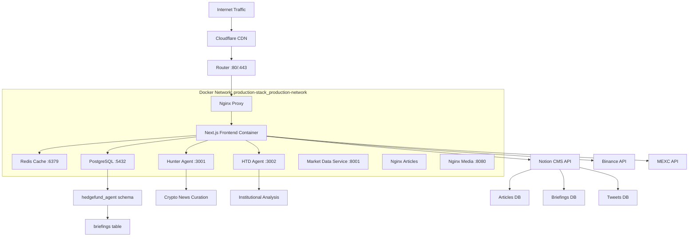

# AGENTS-frontend.md - AI Agent Documentation for DutchBrat Platform Frontend

## 🤖 Project Overview for AI Agents

**Project Name**: DutchBrat Web3 Financial Intelligence Platform Frontend  
**Architecture**: Next.js 14 Frontend with Microservice Integration Layer  
**Purpose**: Service orchestration hub for crypto/financial analysis platform  
**Deployment**: Self-hosted Docker infrastructure (Node.js 20.x)  

## 🌐 Infrastructure & Network Architecture

**Public IP**: `194.6.252.207`  
**Hosting**: Self-managed VM with Docker containerization  
**Network**: Internal Docker networking with reverse proxy architecture  

### Port Configuration
- **Port 80**: HTTP traffic (redirects to HTTPS)
- **Port 443**: HTTPS traffic (main website entry point)
- **Ports 3001/3002**: Internal-only via Docker networking (AI agents)

### Network Architecture
- **Network Name**: `production-stack_production-network`
- **Type**: Bridge network (Docker internal)
- **Container Communication**: Name-based service discovery
- **External Access**: Only through nginx-proxy (port 80)
- **Reverse Proxy**: Nginx routes traffic to frontend container

## 📋 Service Integration Architecture



## 🳠Docker Infrastructure

### Container Configuration
```bash
# Production Stack Containers
CONTAINER                 IMAGE                                  PORTS
nginx-proxy              nginx:latest                           0.0.0.0:80->80/tcp
frontend                 production-stack_frontend              Internal: 3000
hunter-agent             production-stack_hunter-agent          Internal: 3001
htd-agent                production-stack_htd-agent             Internal: 3002
market-data-service      production-stack_market-data-service   0.0.0.0:8001->8001/tcp
redis                    redis:7-alpine                         Internal: 6379
postgres                 postgres:15                            0.0.0.0:5432->5432/tcp
nginx-articles           nginx:alpine                           Internal
nginx-media              nginx:latest                           0.0.0.0:8080->80/tcp
```

## 🗂️ Frontend Application Structure

### Next.js 14 App Router Architecture
```
frontend/
├── app/                           # Next.js 14 App Router (PRIMARY)
│   ├── api/                       # Service Integration Layer
│   │   ├── articles/route.ts      # Notion CMS integration
│   │   ├── briefings/route.ts     # Multi-tier cache orchestration
│   │   ├── crypto-news/route.ts   # Hunter-Agent proxy (internal: hunter-agent:3001)
│   │   ├── hedgefund-news/route.ts # HTD-Agent proxy (internal: htd-agent:3002)
│   │   ├── latest-briefing/route.ts # Briefing metadata aggregation
│   │   ├── latest-tweet/route.ts   # Social media integration
│   │   ├── latest-hedgefund-tweet/route.ts # HF commentary integration
│   │   ├── mexc/route.ts          # Exchange API proxy
│   │   └── htd-articles/route.ts  # HTD research article integration
│   ├── articles/                  # Unified Article System
│   │   ├── page.tsx              # Server component wrapper
│   │   └── ArticlesClient.tsx     # Client-side article browser
│   ├── briefings/                 # Market Briefing System  
│   │   ├── page.tsx              # Server component wrapper
│   │   ├── BriefingsClient.tsx    # Client-side briefing viewer
│   │   └── BriefingsArchive.tsx   # Archive tree navigation
│   ├── components/                # UI Component Layer
│   │   ├── HeroIntro.tsx         # Landing page hero section
│   │   ├── HunterBlock.tsx       # AI assistant showcase
│   │   ├── CryptoPriceBlock.tsx  # Real-time price dashboard
│   │   ├── LatestArticleCard.tsx # Article preview component
│   │   ├── LatestHTDArticleCard.tsx # HTD research preview
│   │   ├── LatestBriefingCard.tsx # Briefing preview component
│   │   ├── CryptoNewsCard.tsx    # Rotating crypto news
│   │   ├── HedgeFundNewsCard.tsx # Institutional news rotation
│   │   ├── TweetCard.tsx         # Social media display
│   │   ├── NotionBlockRenderer.tsx # Rich content rendering
│   │   ├── EconomicCalendarWidget.tsx # TradingView integration
│   │   └── ErrorBoundary.tsx     # Error handling wrapper
│   ├── layout.tsx                # App-wide layout with navbar
│   ├── page.tsx                  # Homepage composition
│   └── globals.css               # Tailwind CSS imports
├── lib/                          # Service Integration Utilities
│   ├── tweetHelpers.ts           # Notion tweet fetching logic
│   ├── twitterApi.ts             # Twitter API with caching
│   ├── twitterRateLimiter.ts     # Rate limiting utility
│   ├── redis.ts                  # Redis service singleton
│   └── gtag.ts                   # Google Analytics helper
├── public/                       # Static assets
│   ├── images/                   # Profile pictures, icons, banners
│   └── icons/                    # Cryptocurrency token icons
└── package.json                  # Dependencies and scripts
```

## 🔧 Technology Stack & Service Integration

### Frontend Framework
- **Next.js 14.1.3**: App Router, Server Components, API Routes
- **React 18.2.0**: Client components with hooks (useState, useEffect)
- **TypeScript 5.3.3**: Full type safety across components and APIs

### Data Integration Layer
- **PostgreSQL 15**: Briefings cache in `hedgefund_agent.briefings` table
- **Redis 7**: Multi-tier caching with ioredis client
- **pg 8.16.3**: PostgreSQL client with connection pooling

### Styling & UI
- **Tailwind CSS 3.4.1**: Utility-first styling, dark theme optimized
- **Lightweight Charts 5.0.8**: Financial charting with candlesticks and volume
- **react-ts-tradingview-widgets 1.2.8**: Economic calendar integration

### Content Management Integration
- **@notionhq/client 2.2.15**: Notion CMS API integration
- **ioredis 5.3.2**: Redis caching for Notion responses
- **Internal NGINX**: HTD research article file serving

### External API Integration
- **Twitter API v2**: Social media content aggregation
- **Binance API**: Cryptocurrency market data
- **MEXC API**: Alternative exchange data
- **TradingView Widgets**: Economic calendar and charting

## 🎯 Service Integration Patterns

### Three-Tier Caching Strategy
```typescript
// lib/redis.ts - Service orchestration pattern
export class RedisService {
  private redis: Redis;
  
  async getBriefing(briefingId: number): Promise<BriefingData | null> {
    // Tier 1: Redis cache (6h TTL)
    const cached = await this.redis.get(`briefing:content:${briefingId}`);
    if (cached) return JSON.parse(cached);
    
    // Tier 2: PostgreSQL cache (persistent)
    const dbResult = await pool.query('SELECT json_content FROM hedgefund_agent.briefings WHERE id = $1', [briefingId]);
    if (dbResult.rows[0]) {
      const data = dbResult.rows[0].json_content;
      await this.setBriefing(briefingId, data); // Cache in Redis
      return data;
    }
    
    // Tier 3: Notion API fallback
    const notionData = await this.fetchFromNotion(briefingId);
    await this.cacheBriefingInDB(briefingId, notionData); // Store in PostgreSQL
    await this.setBriefing(briefingId, notionData); // Cache in Redis
    return notionData;
  }
}
```

### Microservice Proxy Pattern
```typescript
// app/api/crypto-news/route.ts - Internal service orchestration
export async function GET() {
  try {
    // Proxy to internal Hunter Agent service
    const response = await fetch('http://hunter-agent:3001/api/latest-crypto-news', {
      headers: { 'Content-Type': 'application/json' }
    });
    
    if (!response.ok) {
      throw new Error(`Hunter Agent returned ${response.status}`);
    }
    
    const data = await response.json();
    return NextResponse.json(data);
  } catch (error) {
    console.error('Error fetching crypto news:', error);
    return NextResponse.json({ error: 'Service unavailable' }, { status: 500 });
  }
}
```

### Database Schema Integration

**Primary Schema**: `hedgefund_agent` (briefings cache)
```sql
CREATE TABLE hedgefund_agent.briefings (
    id SERIAL PRIMARY KEY,
    notion_page_id VARCHAR(255) UNIQUE NOT NULL,
    title VARCHAR(500) NOT NULL,
    published_at TIMESTAMP NOT NULL,
    json_content JSONB NOT NULL,
    created_at TIMESTAMP DEFAULT CURRENT_TIMESTAMP,
    updated_at TIMESTAMP DEFAULT CURRENT_TIMESTAMP
);

CREATE INDEX idx_briefings_published_at ON hedgefund_agent.briefings(published_at DESC);
CREATE INDEX idx_briefings_notion_page_id ON hedgefund_agent.briefings(notion_page_id);
```

### Redis Cache Structure
```typescript
// Cache Keys & TTL Strategy
"briefing:content:{briefingId}"           // Individual briefing (6h TTL)
"briefing:notion:{notionPageId}"          // Notion ID mapping (24h TTL)
"briefings:list:latest"                   // Recent briefings list (30m TTL)
"briefings:tree-metadata"                 // Archive tree structure (1h TTL)
"briefings:by-date:{date}"                // Date-specific briefings (30m TTL)
"briefing:building:{briefingId}"          // Lock for concurrent fetch prevention
```

## 🌍 External Service Integration

### Notion CMS Integration
```typescript
// Multi-database Notion integration
const notionDatabases = {
  ARTICLES: process.env.NOTION_DB_ID,
  BRIEFINGS: process.env.NOTION_PDF_DATABASE_ID,
  TWEETS: process.env.NOTION_TWEET_LOG_DB,
  HF_TWEETS: process.env.HEDGEFUND_TWEET_DB_ID
};

// Integration pattern with caching
async function fetchNotionDatabase(databaseId: string, filter?: any) {
  const cacheKey = `notion:db:${databaseId}:${JSON.stringify(filter)}`;
  const cached = await redis.get(cacheKey);
  if (cached) return JSON.parse(cached);
  
  const response = await notion.databases.query({
    database_id: databaseId,
    filter,
    sorts: [{ property: 'Date', direction: 'descending' }]
  });
  
  await redis.setex(cacheKey, 1800, JSON.stringify(response)); // 30min cache
  return response;
}
```

### Exchange API Integration
```typescript
// Binance API integration with error handling
async function fetchBinancePrice(symbol: string) {
  try {
    const response = await fetch(`https://api.binance.com/api/v3/ticker/price?symbol=${symbol}`);
    if (!response.ok) throw new Error(`Binance API error: ${response.status}`);
    return await response.json();
  } catch (error) {
    console.error('Binance API error:', error);
    // Fallback to MEXC
    return await fetchMexcPrice(symbol);
  }
}
```

### HTD Research Integration
```typescript
// HTD articles integration via internal NGINX
export async function GET(request: Request) {
  const { searchParams } = new URL(request.url);
  const articleId = searchParams.get('id');
  
  if (articleId) {
    // Fetch single article content
    const articleUrl = `http://nginx-articles/htd-articles/${articleId}`;
    const response = await fetch(articleUrl);
    
    if (response.ok) {
      const content = await response.text();
      return new Response(content, {
        headers: { 'Content-Type': 'text/markdown' }
      });
    }
  }
  
  // List articles with metadata scanning
  const articlesDir = '/app/htd-articles';
  const files = await fs.readdir(articlesDir);
  const articles = await Promise.all(files.map(parseArticleMetadata));
  
  return NextResponse.json(articles.sort((a, b) => 
    new Date(b.date).getTime() - new Date(a.date).getTime()
  ));
}
```

## 🔗 API Route Organization

### Service Integration Routes
- **`/api/articles`** - Notion CMS article aggregation
- **`/api/briefings`** - Multi-tier briefing cache orchestration
- **`/api/latest-briefing`** - Latest briefing metadata with caching
- **`/api/latest-tweet`** - Social media integration with rate limiting
- **`/api/latest-hedgefund-tweet`** - Institutional social media content

### Microservice Proxy Routes
- **`/api/crypto-news`** - Hunter Agent proxy (hunter-agent:3001)
- **`/api/hedgefund-news`** - HTD Agent proxy (htd-agent:3002)
- **`/api/mexc`** - Exchange API proxy with error handling

### Content Integration Routes
- **`/api/htd-articles`** - HTD research article file system integration
- **`/api/htd-articles?id={id}`** - Single article content fetching

## 🛡️ Error Handling & Resilience Patterns

### Service Fallback Strategy
```typescript
// Multi-service fallback pattern
async function fetchMarketData(symbol: string) {
  const services = [
    () => fetchBinancePrice(symbol),
    () => fetchMexcPrice(symbol),
    () => fetchCachedPrice(symbol)
  ];
  
  for (const service of services) {
    try {
      const result = await service();
      if (result) return result;
    } catch (error) {
      console.warn(`Service failed, trying next:`, error.message);
    }
  }
  
  throw new Error('All market data services unavailable');
}
```

### Cache-First Error Recovery
```typescript
// Graceful degradation with caching
export async function GET() {
  try {
    // Try fresh data
    const freshData = await fetchFromNotion();
    await cacheData(freshData);
    return NextResponse.json(freshData);
  } catch (error) {
    // Fallback to cached data
    const cachedData = await getCachedData();
    if (cachedData) {
      return NextResponse.json(cachedData, {
        headers: { 'X-Data-Source': 'cache' }
      });
    }
    
    return NextResponse.json({ error: 'Service unavailable' }, { status: 503 });
  }
}
```

## 📊 Performance Optimization Strategies

### Lazy Loading Implementation
```typescript
// Archive navigation with lazy loading
const [expandedDates, setExpandedDates] = useState<Set<string>>(new Set());
const [briefingsByDate, setBriefingsByDate] = useState<Record<string, any[]>>({});

const toggleDate = async (date: string) => {
  if (!expandedDates.has(date)) {
    const briefings = await fetchBriefingsForDate(date);
    setBriefingsByDate(prev => ({ ...prev, [date]: briefings }));
    setExpandedDates(prev => new Set([...prev, date]));
  } else {
    setExpandedDates(prev => {
      const newSet = new Set(prev);
      newSet.delete(date);
      return newSet;
    });
  }
};
```

### Connection Pool Management
```typescript
// PostgreSQL connection pool for service integration
import { Pool } from 'pg';

const pool = new Pool({
  host: process.env.POSTGRES_HOST || 'postgres',
  port: parseInt(process.env.POSTGRES_PORT || '5432'),
  database: process.env.POSTGRES_DB || 'agents_platform',
  user: process.env.POSTGRES_USER || 'hunter_admin',
  password: process.env.POSTGRES_PASSWORD,
  max: 20, // Maximum pool size
  idleTimeoutMillis: 30000, // Close idle clients after 30s
  connectionTimeoutMillis: 2000, // Return error after 2s if no connection available
});
```

## 🔧 Environment Configuration

### Required Environment Variables
```bash
# Notion CMS Integration
NOTION_API_KEY=secret_xxx                    # Notion workspace API key
NOTION_DB_ID=database_id_for_articles        # Articles database
NOTION_TWEET_LOG_DB=database_id_for_tweets   # Tweet log database  
NOTION_PDF_DATABASE_ID=database_id_briefings # Briefings database
HEDGEFUND_TWEET_DB_ID=database_id_hf_tweets  # HedgeFund tweet database

# PostgreSQL Database
POSTGRES_HOST=postgres                       # Docker service name
POSTGRES_PORT=5432                          # Default PostgreSQL port
POSTGRES_DB=agents_platform                 # Database name
POSTGRES_USER=hunter_admin                  # Database user
POSTGRES_PASSWORD=YourSecurePassword123!    # Database password

# Redis Cache
REDIS_HOST=redis                            # Docker service name
REDIS_PORT=6379                             # Default Redis port

# Twitter API
TWITTER_BEARER_TOKEN=AAA...                 # Twitter API v2 bearer token

# Analytics
NEXT_PUBLIC_GA_MEASUREMENT_ID=G-...         # Google Analytics 4 measurement ID
```

## 📈 Scalability Architecture

### Current Performance Targets
- **Tree Metadata**: < 500ms (cached) or < 2s (uncached)
- **Date Briefings**: < 300ms (cached) or < 1s (uncached)
- **Single Briefing**: < 200ms (cached) or < 2s (with Notion fetch)
- **Cache Hit Rate**: Target 90%+ for frequently accessed briefings

### Archive Navigation Scalability
- **Year → Month → Day tree**: Handles unlimited briefings efficiently
- **Lazy Loading**: Only fetch briefings when user expands date
- **Database Indexing**: `published_at` index for fast queries
- **Redis Caching**: Reduces database load by 80%+

### Microservice Integration Scaling
- **Service Discovery**: Docker internal networking with service names
- **Load Balancing**: Nginx proxy with upstream configuration
- **Connection Pooling**: Shared PostgreSQL connections across services
- **Cache Distribution**: Redis as shared cache layer for all services

---

**For AI Agents**: This frontend serves as the service orchestration hub for the DutchBrat platform. Focus on the three-tier caching strategy (Redis → PostgreSQL → External APIs) and the microservice proxy patterns when making modifications. The system emphasizes resilience through fallback strategies and performance through multi-level caching. All external service integrations include error handling and graceful degradation.
