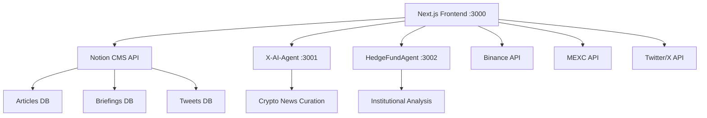

# AGENTS.md - AI Agent Documentation for DutchBrat Platform

## 🤖 Project Overview for AI Agents

**Project Name**: DutchBrat Web3 Financial Intelligence Platform  
**Architecture**: Next.js 14 Frontend + Multiple AI Backend Services  
**Purpose**: Bridge TradFi and DeFi with AI-powered market analysis  
**Deployment**: Node.js 20.x production environment  

## 📋 System Architecture Map



## 🗂️ File Structure Analysis

### Core Application Structure
```
frontend/
├── app/                           # Next.js 14 App Router (PRIMARY)
│   ├── api/                       # Backend API Routes
│   │   ├── articles/route.ts      # Notion articles integration
│   │   ├── briefings/route.ts     # Market briefings with content parsing
│   │   ├── crypto-news/route.ts   # X-AI-Agent proxy (port 3001)
│   │   ├── hedgefund-news/route.ts # HedgeFund-Agent proxy (port 3002)
│   │   ├── latest-briefing/route.ts # Latest briefing metadata
│   │   ├── latest-tweet/route.ts   # Web3Dobie tweet fetcher
│   │   ├── latest-hedgefund-tweet/route.ts # HF commentary
│   │   └── mexc/route.ts          # MEXC exchange proxy
│   ├── articles/                  # Article browsing system
│   │   ├── page.tsx              # Server component wrapper
│   │   └── ArticlesClient.tsx     # Client-side article browser
│   ├── briefings/                 # Market briefing system  
│   │   ├── page.tsx              # Server component wrapper
│   │   └── BriefingsClient.tsx    # Client-side briefing viewer
│   ├── components/                # Reusable UI components
│   │   ├── HeroIntro.tsx         # Landing page hero section
│   │   ├── HunterBlock.tsx       # AI assistant showcase
│   │   ├── CryptoPriceBlock.tsx  # Real-time price dashboard
│   │   ├── LatestArticleCard.tsx # Article preview component
│   │   ├── LatestBriefingCard.tsx # Briefing preview component
│   │   ├── CryptoNewsCard.tsx    # Rotating crypto news
│   │   ├── HedgeFundNewsCard.tsx # Institutional news rotation
│   │   ├── TweetCard.tsx         # Generic tweet display component
│   │   ├── NotionBlockRenderer.tsx # Rich content from Notion
│   │   ├── EconomicCalendarWidget.tsx # TradingView integration
│   │   └── ErrorBoundary.tsx     # Error handling wrapper
│   ├── layout.tsx                # App-wide layout with navbar
│   ├── page.tsx                  # Homepage composition
│   └── globals.css               # Tailwind CSS imports
├── lib/                          # Utility libraries
│   ├── tweetHelpers.ts           # Notion tweet fetching logic
│   ├── twitterApi.ts             # Twitter API with caching
│   ├── twitterRateLimiter.ts     # Rate limiting utility
│   └── gtag.ts                   # Google Analytics helper
├── public/                       # Static assets
│   ├── images/                   # Profile pictures, icons, banners
│   └── icons/                    # Cryptocurrency token icons
└── package.json                  # Dependencies and scripts
```

## 🔧 Technology Stack Deep Dive

### Frontend Framework
- **Next.js 14.1.3**: App Router, Server Components, API Routes
- **React 18.2.0**: Client components with hooks (useState, useEffect)
- **TypeScript 5.3.3**: Full type safety across components and APIs

### Styling & UI
- **Tailwind CSS 3.4.1**: Utility-first styling, dark theme optimized
- **Lightweight Charts 5.0.8**: Financial charting with candlesticks and volume
- **react-ts-tradingview-widgets 1.2.8**: Economic calendar integration

### Data Management
- **@notionhq/client 4.0.1**: CMS integration for articles/briefings
- **node-fetch 3.3.2**: HTTP client for external API calls
- **Built-in caching**: Memory-based caching for API responses

## 🌐 API Integration Patterns

### Internal API Routes (Next.js)
```typescript
// Pattern: /app/api/[endpoint]/route.ts
export const dynamic = 'force-dynamic' // Disable caching
export async function GET(request: NextRequest) {
  // API logic here
  return NextResponse.json(data)
}
```

### External Service Integration
```typescript
// X-AI-Agent Integration
const XAAI_ENDPOINT = "http://74.241.128.114:3001/crypto-news-data"

// HedgeFund Agent Integration  
const HF_ENDPOINT = "http://74.241.128.114:3002/hedgefund-news-data"

// Binance API (Direct)
const BINANCE_API = "https://api.binance.com/api/v3/"

// MEXC API (Proxied)
const MEXC_PROXY = "/api/mexc?symbol={symbol}&endpoint={endpoint}"
```

## 📊 Data Flow Architecture

### Content Management Flow
1. **Notion CMS** → Articles, Briefings, Tweet logs stored
2. **API Routes** → Transform Notion data to frontend format
3. **Client Components** → Render content with rich formatting
4. **Real-time Updates** → Polling-based refresh (5-15min intervals)

### Market Data Flow
1. **Price APIs** → Binance (primary), MEXC (secondary) 
2. **Chart Data** → OHLCV data fetched on-demand
3. **Real-time Display** → 30-second refresh intervals
4. **Interactive Charts** → Modal overlays with detailed analysis

### AI Content Flow
1. **External AI Agents** → Generate news analysis and commentary
2. **Proxy APIs** → Fetch and cache AI-generated content
3. **Rotation Logic** → Cycle through content every 5-15 minutes
4. **User Interface** → Cards with expand/collapse functionality

## 🧩 Component Architecture

### Composition Pattern
```typescript
// Homepage composition
<main>
  <CryptoPriceBlock />    // Market data dashboard
  <HeroIntro />           // Personal introduction + HF content
  <HunterBlock />         // AI assistant + rotating crypto content
</main>

// Card-based content display
<HunterBlock>
  <LatestArticleCard />   // Most recent article
  <LatestTweetCard />     // Latest social media  
  <CryptoNewsCard />      // Rotating AI news
</HunterBlock>
```

### State Management Patterns
```typescript
// Client-side state with hooks
const [data, setData] = useState<DataType[]>([])
const [loading, setLoading] = useState(true)
const [error, setError] = useState<string | null>(null)

// Auto-refresh with intervals
useEffect(() => {
  fetchData()
  const interval = setInterval(fetchData, 5 * 60 * 1000) // 5min
  return () => clearInterval(interval)
}, [])
```

## 🔐 Environment Variables

### Required Configuration
```bash
# Notion CMS Integration
NOTION_API_KEY=secret_xxx                    # Notion workspace API key
NOTION_DB_ID=database_id_for_articles       # Articles database
NOTION_TWEET_LOG_DB=database_id_for_tweets  # Tweet log database  
NOTION_PDF_DATABASE_ID=database_id_briefings # Briefings database
HEDGEFUND_TWEET_DB_ID=database_id_hf_tweets  # HedgeFund tweet database

# Optional External Services
TWITTER_BEARER_TOKEN=bearer_token_xxx        # Twitter API v2 access
GA_TRACKING_ID=G-XRESBQDDQ7                 # Google Analytics
```

## 📝 Database Schema (Notion)

### Articles Database Schema
```typescript
interface NotionArticle {
  Headline: { title: RichText[] }           // Article title
  Summary: { rich_text: RichText[] }        // Brief description
  File: { url: string }                     // Markdown content URL
  Date: { date: { start: string } }         // Publication date
  Tweet: { url: string }                    // Associated tweet URL
  Tags: { multi_select: SelectOption[] }    // Content tags
  Status: { select: { name: string } }      // Published/Draft
  Category: { select: { name: string } }    // Content category
}
```

### Briefings Database Schema
```typescript
interface NotionBriefing {
  Name: { title: RichText[] }               // Briefing title
  Period: { select: { name: string } }      // pre_market/morning/mid_day/after_market
  Date: { date: { start: string } }         // Briefing date
  "PDF Link": { url: string }              // Content URL
  "Tweet URL": { url: string }             // Social media link
  "Market Sentiment": { rich_text: RichText[] } // AI sentiment analysis
}
```

## 🎯 Key Development Patterns

### Error Handling Strategy
```typescript
// API Route Error Handling
try {
  const data = await fetchExternalAPI()
  return NextResponse.json(data)
} catch (error) {
  console.error('API Error:', error)
  return NextResponse.json(
    { error: 'Service unavailable' },
    { status: 500 }
  )
}

// Component Error Boundaries
<ErrorBoundary fallback={<FallbackUI />}>
  <DataComponent />
</ErrorBoundary>
```

### Performance Optimization
```typescript
// Dynamic imports for code splitting
const BriefingsClient = dynamic(() => import('./BriefingsClient'), {
  ssr: false,
  loading: () => <LoadingSpinner />
})

// Memoization for expensive calculations
const memoizedData = useMemo(() => 
  processLargeDataset(rawData), [rawData]
)
```

## 🚨 Critical Dependencies

### Must-Have Libraries
- `@notionhq/client`: CMS integration (cannot be replaced)
- `lightweight-charts`: Financial visualization (specific to finance)
- `tailwindcss`: Design system foundation
- `next`: Core framework dependency

### Replaceable Dependencies
- `node-fetch`: Can use native fetch in Node 18+
- `react-ts-tradingview-widgets`: TradingView alternative widgets available

## 🔄 Data Refresh Patterns

### Refresh Intervals by Content Type
```typescript
const REFRESH_INTERVALS = {
  cryptoPrices: 30_000,      // 30 seconds
  articles: 300_000,         // 5 minutes  
  briefings: 300_000,        // 5 minutes
  tweets: 600_000,           // 10 minutes
  aiNews: 900_000,           // 15 minutes
  hedgeFundNews: 1_800_000   // 30 minutes
}
```

## 🎨 Design System Constants

### Color Palette
```css
:root {
  --primary-bg: #030712;      /* gray-950 */
  --secondary-bg: #111827;    /* gray-900 */
  --accent-blue: #3b82f6;     /* blue-500 */
  --success-green: #10b981;   /* green-500 */
  --danger-red: #ef4444;      /* red-500 */
  --text-primary: #ffffff;    /* white */
  --text-secondary: #d1d5db;  /* gray-300 */
}
```

### Component Size Guidelines
```typescript
const COMPONENT_SIZES = {
  profileImages: '200px',      // Hero sections
  chartHeight: '500px',        // Price charts
  cardMinHeight: '200px',      // Content cards
  modalMaxWidth: '4xl',        // Chart modals
}
```

## 🧪 Testing Approach

### Manual Testing Requirements
1. **Cross-browser compatibility**: Chrome, Firefox, Safari, Edge
2. **Mobile responsiveness**: Phone, tablet, desktop breakpoints
3. **API error handling**: Network failures, timeout scenarios
4. **Content loading states**: Empty states, loading spinners
5. **Real-time updates**: Data refresh cycles, user interactions

### Performance Testing
1. **Lighthouse scores**: Aim for 90+ performance score
2. **Bundle analysis**: Monitor JavaScript bundle sizes
3. **API response times**: < 2s for all endpoints
4. **Image optimization**: WebP format, proper sizing

## 🔧 Development Workflow

### Local Development Setup
```bash
# Install dependencies
npm install

# Environment setup
cp .env.example .env.local  # Configure API keys

# Development server
npm run dev                 # Runs on http://localhost:3000

# Type checking
npx tsc --noEmit           # Verify TypeScript compilation

# Production build test
npm run build && npm start # Test production build locally
```

### Debugging Tools
- **Next.js Dev Tools**: Built-in error overlay and debugging
- **React Developer Tools**: Component tree inspection
- **Network Tab**: API call monitoring and timing
- **Console Logging**: Strategic logging for data flow tracking

## 🚀 Deployment Considerations

### Build Requirements
- **Node.js**: Version 20.x (specified in package.json engines)
- **Memory**: Minimum 512MB recommended for build process
- **Environment**: All required env vars must be set
- **Port**: Configurable via $PORT environment variable

### Production Optimizations
- **Static Asset Caching**: Images, CSS, JavaScript cached at CDN level
- **API Response Caching**: Appropriate cache headers for API responses
- **Bundle Optimization**: Tree shaking and code splitting enabled
- **Image Optimization**: Next.js automatic image optimization

---

**For AI Agents**: This documentation provides the foundational understanding needed to contribute to the DutchBrat platform. Focus on the component patterns, data flow architecture, and API integration strategies when making modifications or additions.